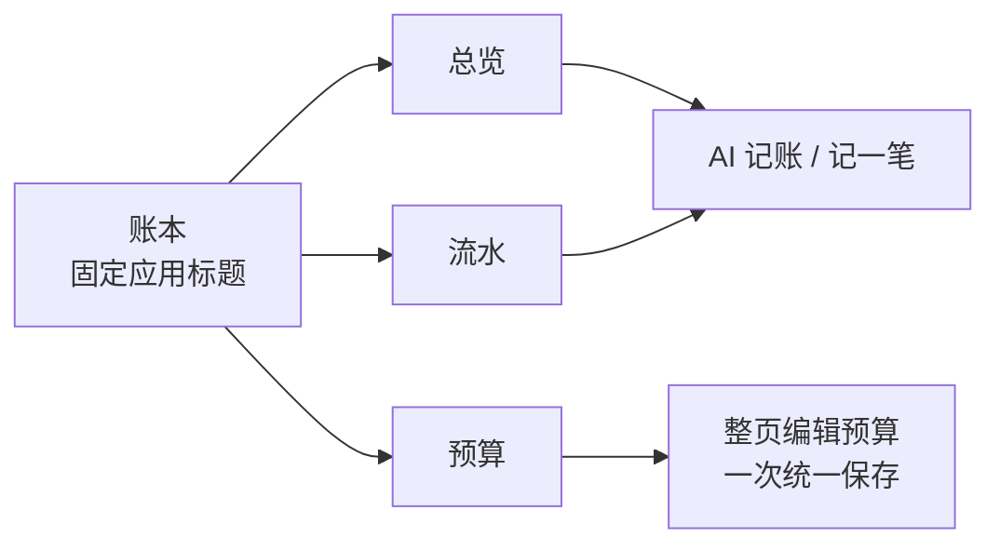
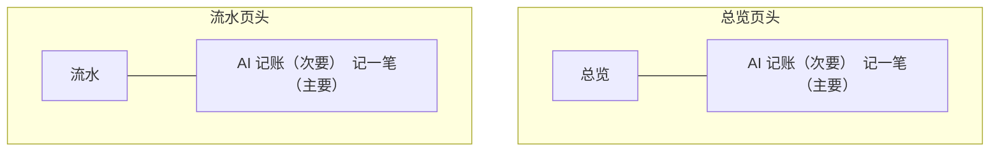
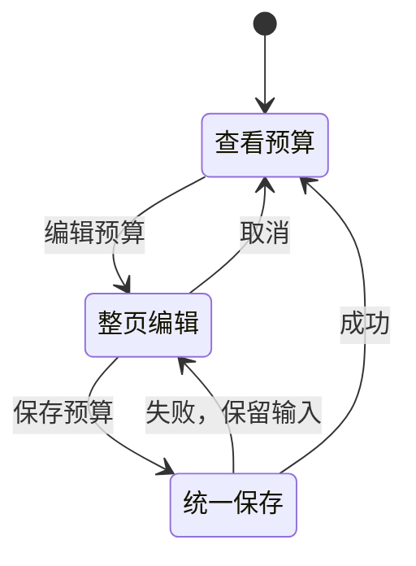

# 账本界面视觉与交互设计

本规范定义账本应用的页面结构、视觉风格和交互方式。顶部 YAML 供程序或模型读取，图和表用于说明页面布局与操作流程。

## 页面结构

“账本”只是固定应用标题，不可选择或修改。分类没有管理页面，只作为流水和预算的选择项。

### 电脑端

- 左侧为浅色导航栏：总览、流水、预算。
- 右侧为最大宽度约 1120px 的主内容区。
- 不使用黑色或近黑色大面积侧栏。

### 手机端

- 顶部显示当前页面标题。
- 底部固定显示总览、流水、预算三个导航入口。
- 页面内容改为单列，触控按钮高度不低于 44px。

## 总览与流水的共同操作区

总览和流水使用同一个操作区组件，按钮的位置、顺序、大小和样式保持一致。

| 设备 | 位置 | 顺序 |
| --- | --- | --- |
| 电脑 | 页面标题右侧 | AI 记账、记一笔 |
| 手机 | 页面标题下方，同一行等宽显示 | AI 记账、记一笔 |

手机端不设置“记一笔”悬浮按钮。两个页面均在标题下方显示完整操作区。

## 总览

总览页面按以下顺序组织：

1. 日期范围：默认本月第一天至今天，不能选择未来日期。
2. 收支摘要：结余、收入、支出。
3. 支出分类：按金额从高到低排列的分类列表。
4. 预算摘要：只在日期范围属于同一个自然月时显示。

电脑端摘要卡片一行显示，手机端摘要卡片改为单列。支出分类列表横跨内容区，每行显示分类图标、名称、金额、占比和横向占比条。

当前日期范围由日期选择器完整表达，标题下方不添加日期说明。无支出状态显示“所选日期内暂无支出”，其中不放置操作按钮。

## 流水

流水页由查询工具和流水列表组成：

| 区域 | 内容 |
| --- | --- |
| 查询工具 | 关键词、日期范围、可多选的收支类型和分类 |
| 电脑列表 | 日期、分类图标与名称、备注、金额、操作 |
| 手机列表 | 分类图标与名称、金额、日期、备注 |
| 分页 | 每页 20 条，上一页、下一页 |

电脑端使用表格，手机端使用卡片。点击编辑进入流水表单；手机端点击卡片即可编辑。删除放在编辑表单内，并在执行前确认，不使用左滑或长按操作。

修改任何筛选条件后回到第一页。日期范围包含两端，结束日期不能晚于今天；清空日期范围后查询全部流水。

收入金额使用绿色和加号。普通支出使用深色和减号，不使用红色；红色只用于删除、错误和超出预算。

## 记账流程

手动记账和 AI 记账最终使用同一套流水字段：收支类型、金额、分类、日期、备注。

- 电脑端表单使用居中对话框，手机端使用接近全屏的底部面板。
- AI 草稿可以修改或移除，确认后才写入数据库。
- 错误显示在当前表单或 AI 面板内。
- 保存成功后直接刷新页面，不弹普通成功 Toast。

## 预算

预算页顶部选择月份，下面依次显示总预算和全部支出分类预算。

- 编辑时，总预算和所有分类预算一起变为输入框。
- 页面只提供一组“取消”和“保存预算”，不逐条保存。
- 未设置预算的分类显示“未设置”。
- 编辑时清空金额表示将该项改为“未设置”，不提供单独删除操作；输入 0 表示“没有预算”，以灰色 100% 进度条显示。
- 月份通过可点击的年月面板选择，并提供前一个月、后一个月快捷按钮，不要求手动输入月份。
- 使用率达到 80% 使用橙色，超过 100% 使用红色，同时显示数值说明。

## 视觉方向

| 内容 | 设计 |
| --- | --- |
| 整体 | 浅灰背景、白色面板、细边框、轻阴影 |
| 主操作 | 暖橙色 `#e8752b` |
| 文字 | 主文字 `#202625`，次要文字 `#747d7a` |
| 状态 | 收入绿色 `#2f8268`，危险红色 `#c94f5d` |
| 圆角 | 面板约 10–12px，输入框和按钮约 8–10px |
| 图标 | 简单线性 SVG；分类图标由前端按固定分类编号映射 |

页面文案不包含宣传口号、欢迎语和连续记账天数。视觉元素不使用卡通插画和装饰性大图。加载、空状态和错误显示在对应内容区域内；空状态不包含操作按钮。
